# Bristol's King Wing

Bristol's King Wing is designed to provide information on where a user can find the best possible fried chicken wing in Bristol, be it meat or vegan. The site was created in response to the growing popularity of fried chicken in Bristol as evidenced by increased google searches over the last 12 months and is designed to also cater to the large vegan population in the city increasing the sites userbase and reach. The top positions are always up for grabs and the site promotes competition within restaurants by allowing them to contact the site owner with their suggested best wing and invite us to their eatery to test their chicken wings. 

Please do take a look at the site - [Bristol's King Wing](https://cwallacebailey.github.io/html_css_portfolio_project1/)

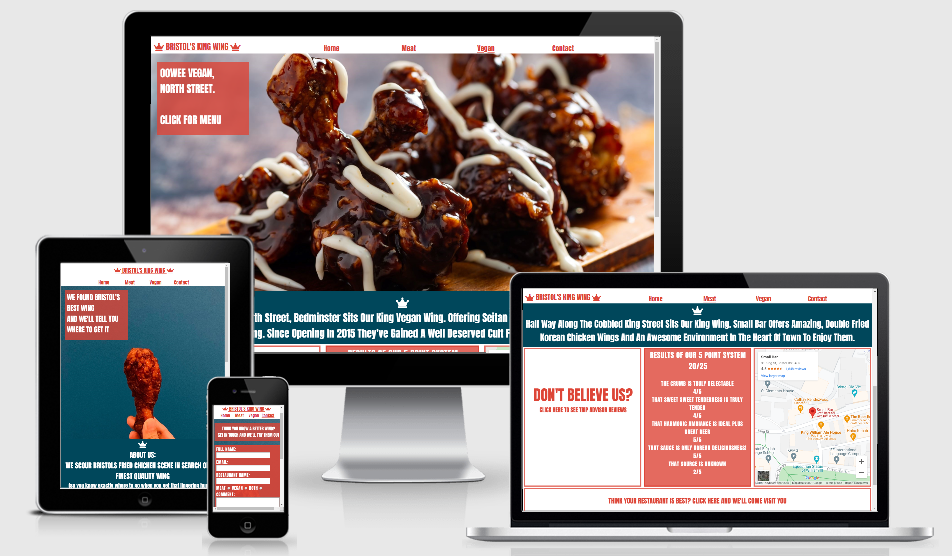

# Contents

* [Reason for Project](#reason-for-project)
* [Features](#features)
    * [Landing Page](#existing-features)
        * [Home](#navigation-menu)
        * [Navigation Menu](#navigation-menu)
        * [Background](#landing-page-background-image)
        * [About Us](#about-us)
        * [User Choice](#user-choice)
        * [Link to Form](#link-to-form)
        * [Footer](#footer)
    * [Meat and Vegan Pages](#meat-and-vegan-pages)
        * [Background](#meat-and-vegan-page-background)
        * [Menu Section](#menu-section-of-meat-and-vegan-pages)
    * [Form Page](#form-page)
        * [Form](#form)
* [Future Features](#future-features)
* [Testing](#testing)
    * [Browser Compatibility](#browser-compatibility)
    * [Responsiveness](#site-responsiveness-testing)
    * [Lighthouse Testing](#lighthouse-testing)
* [Bugs](#bugs)
    * [Fixed](#fixed)
    * [Not-Fixed](#not-fixed)
* [Deployment](#deployment)
* [Credits](#credits)

# Reason for Project

As stated in the intro there has been growing demand for information on the best fried chicken in Bristol as evidenced by the increased google searches shown below.

The first for "best chicken wing":

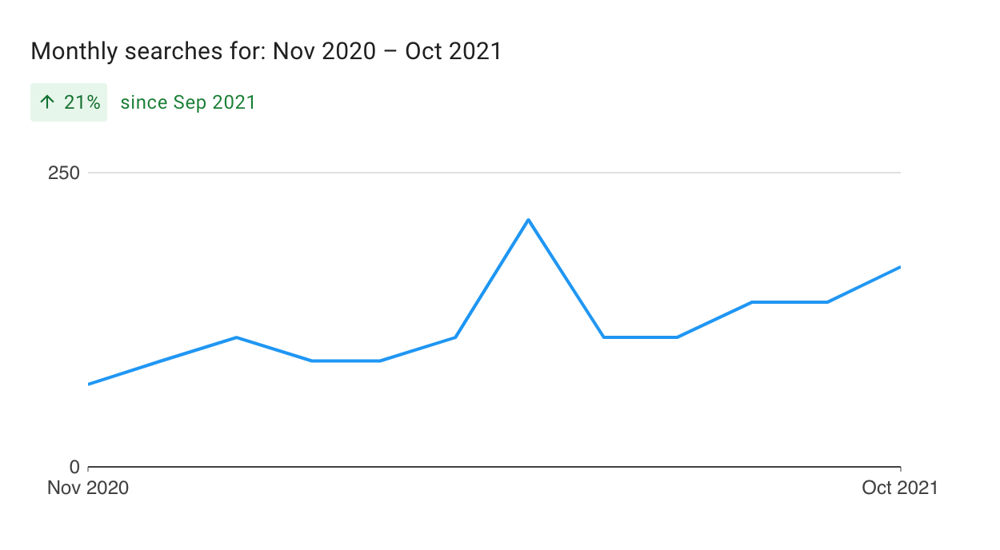

The second for "best fried chicken": 

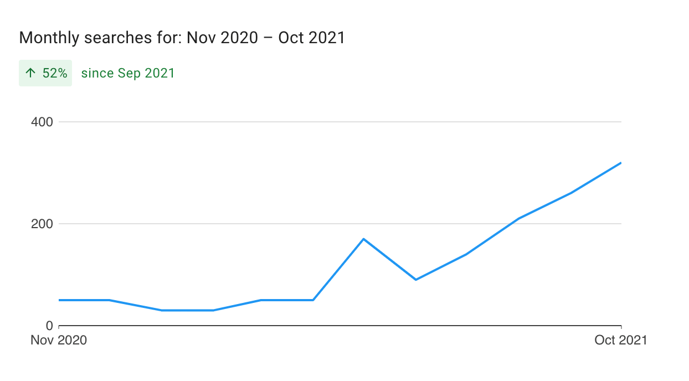

We can clearly see an increased demand for the information that the site aimed to deliver and having researched there were no obvious competitors offering the same service as Bristol King Wing. 

# Features

Bristol's Best Wing site is designed to be easy to use and present all the information required for the sites recommendation to be trusted. It has features that users of a food site would be familiar with including navigation bar, maps to restaurant, provide access to tripadvisor reviews, details of the eatery and a contact form. 

The site is also designed to inspire hunger for the product in a user, be eye catching and easy to use such that the user is encouraged to explore the site.

[return to contents](<#contents>)

## Existing Features

* ### Navigation Menu

    * Located at the top of all the sites pages and is fully responsive, centering when the screen width is reduced.
    * The nav bar has links to all pages allowing the user to easily navigate through the site and avoids them having to use the 'back' button
    * For a greater UX experience:
        * The logo is a link to the home page
        * The nav menu sticks to the top of the screen and travels with the user as they scroll down the page for greater ease of navigation
        * The page the user is on is underlined
        * When hovered over the menu item changes blue
    
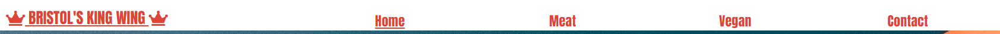

[return to contents](<#contents>)

* ### Landing Page Background Image
    * The image of a wing held centrally on the screen is designed to make the focus of the site immediately clear to the user
    * The text box overlayed onto the image allows the user to see the location the site focuses on and to give a message of what the site is for backed up by the about section (below)
    * The image is responsive to screen size and will rotate on smaller screens to always be clear

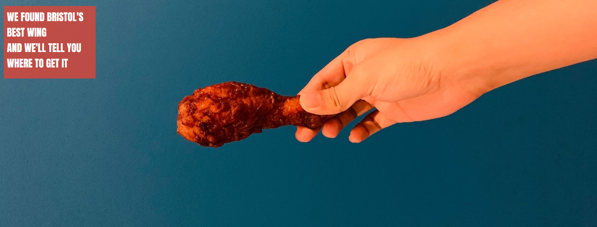

[return to contents](<#contents>)

* ### About us
    * This section gives the user further details on the benefit the site will provide
    * The font is chosen to be clear and displays the sites icon of a crown above which is a common theme throughout the website above. The section tells the user to keep scrolling to see our top product choices
    * The section height is responsive to the screen width and increases to always allow the text to be clear and visible no matter the size of the screen the site is viewed on
    * On the Meat or Vegan pages this section offers details about the restaurant we've picked as the best product available in Bristol which is valuable to the user as it gives them a better idea why we picked this restaurant. 

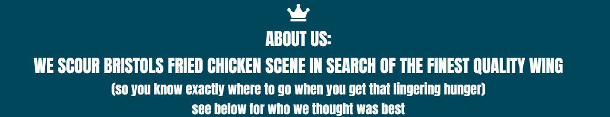

[return to contents](<#contents>)

* ### User Choice
    * The language used in this section is designed to achieve a slight comedic effect to elicit a positive user response
    * The central box in this section outlines our scoring system as to how we rate the chicken wings when we test them
    * The left box is for a user who eats meat and the text that says "click here" is a link to the meat options page.
    * The right box is for a vegan user. The text that says "click here" is a link to the vegan options page.
    * The border was used to give three distinct segments. 
    * These sections stack when viewed on a screen smaller than 1200px

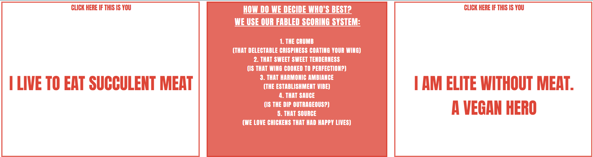

[return to contents](<#contents>)

* ### Link to form
    * This section offers an easy to use link to our submissions form on our 'contact' page to the sites user, be they restaurant owner or punter who has been to what they believe is a better restaurant
    * The description in the section immediately lets the user know what it is for and the text is itself a link to the contact page for ease of use
    * This offers value to the user as it is simple to use but inspires friendly competition between eateries and allows the user to feel connected with the site as they contribute their ideas for the best fried chicken wing in Bristol
    * This section is available on all tabs except the 'contact' page

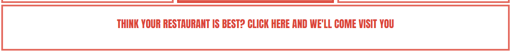

[return to contents](<#contents>)

* ### Footer
    * This section contains links to social media pages and is available on all four pages of the site. To offer a greater UX experience once clicked they open in new tabs
    * The links would allow the user to see more restaurants that we have tried (on Instagram and Youtube) and how we rated those experiences. Note the links currently link to the social media home pages and not Bristol King Wing specific pages which have not yet been made. 
    * This offers value to the user to allow them to explore more of the brands content. 

[return to contents](<#contents>)

### Meat and Vegan pages

* ### Meat and vegan page background
    * Once selected the meat or vegan page immediately shows our top meat or vegan choice in Bristol, named in the text box overlayed onto the image. The background image on the meat page is itself the inside of the eatery and shows the brand of the chicken. The vegan image is designed to look enticing and promote hunger in the user
    * The text overlayed onto the image which says 'click for menu' would take the user to the restaurants online menu. For better UX this opens in a new tab and offers value as the user can see if they like the food being offerred and assess its cost. 
    * On screens below 950px this background changes to the home landing image so a clear picture is always maintained on the site

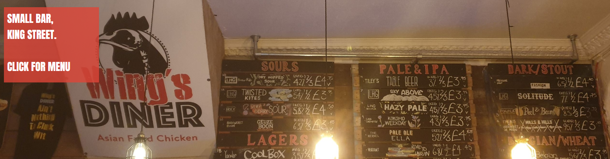
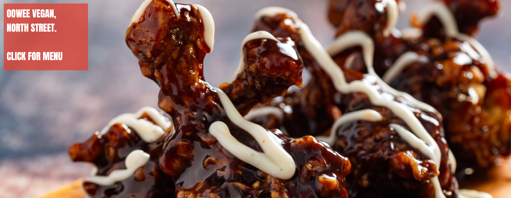
[return to contents](<#contents>)

* ### Menu section of meat and vegan pages

    * The centre box of this section outlines our total score for the restaurant and score of each of the five items by which we rank the food
    * The left box offers links to trip advisor to allow the user to see what other diners thought of the food. This offers value to the user as seeing other positive reviews would instil trust in the site's top choice. For a better user experience this link opens in a separate tab
    * The right box shows a google map of the restaurants location and can be clicked on to see the address. This also opens in a separate tab and from there a user can put in their location to get directions to the restaurant. This offers value as it provides an easy way for the user to find the restaurant

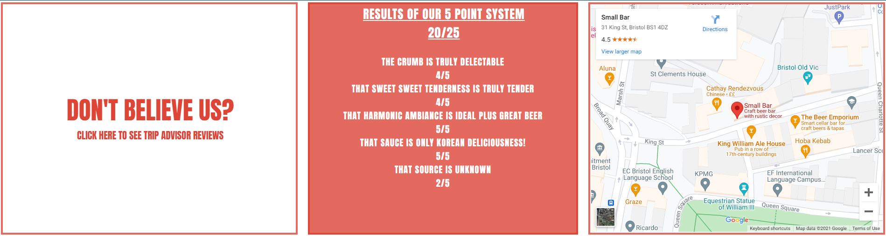
[return to contents](<#contents>)

### Form page

The purpose of this page is highlighted in the text box overlayed onto the background image. It allows a user to submit their choice of restaurant for review

* ### Form
    * The form is designed to allow a user to recommend their favourite restaurant to the person running the site if they think they know a better wing than the current top choices on the page
    * The form offers 5 sections, name, email, restaurant name, a radio selection to say if their choice offers meat, vegan or both options and finally a comments section. 
    * The form first four sections of the form are 'required' in order to submit the form and if missed by the user when they click submit they will be asked to fill in a missing section. The comments section is optional

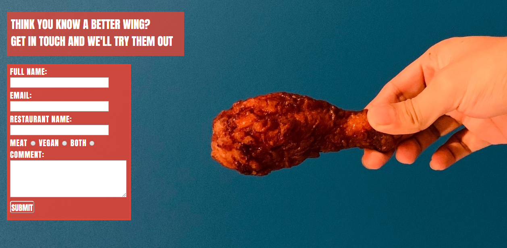
[return to contents](<#contents>)

## Future Features

* A top 3 section would be added to the meat and vegan pages where the user can see other restaurants that offer great food but wouldn't be considered the best possible option. This would make the site more usable as it may recommend extra eateries that are closer to the user. 
* The footer links to each social media's channels homepage. At the moment social media pages do not exist for Instagram, Facebook or Youtube and these would first have to be made to link to. 
* A 'get me there' button could be added which would take the user to a map and options for travel to the restaurant including taxis. 
* The form section does not currently actually submit data. It instead resets the form when submit is clicked. 

# Testing

## Validation of Code

The Bristol's King Wing site had been extensively tested. The code has been run through the [W3C html Validator](https://validator.w3.org/) and [W3C CSS validator](https://jigsaw.w3.org/css-validator/) with no errors. The home, meat, vegan and form page all returned the image below: 

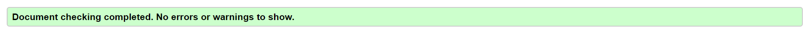

The CSS code returned the response below: 

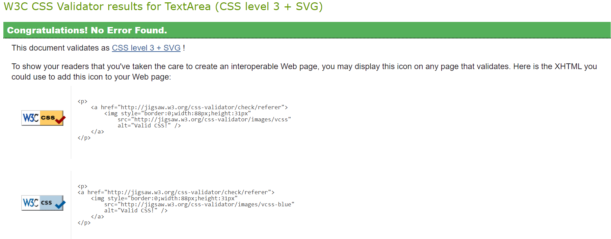

[return to contents](<#contents>)

# Browser Compatibility

This site was tested on Firefox, Google Chrome and Internet explorer. While functionality and responsiveness were consistent between browsers the appearance had two slight changes which needed to be fixed. Details can be found [here](#fixed)

[return to contents](<#contents>)

# Site Responsiveness Testing

To ensure the site was easily and effectively viewable on different sized screens or on different devices manual tests were carried out using Google Chrome DevTools. The site is responsive and function on the devices and screen sizes below:
* iPhone SE
* iPhone X
* Pixel 2
* iPad
* iPad Pro
* Screens between 950px and 1920px

This was also tested on my own phone and reviewed by a peer on their own iMac screen. 

[return to contents](<#contents>)

# Lighthouse Testing
Finally the site was tested using google's lighthouse and received the scores seen below: 

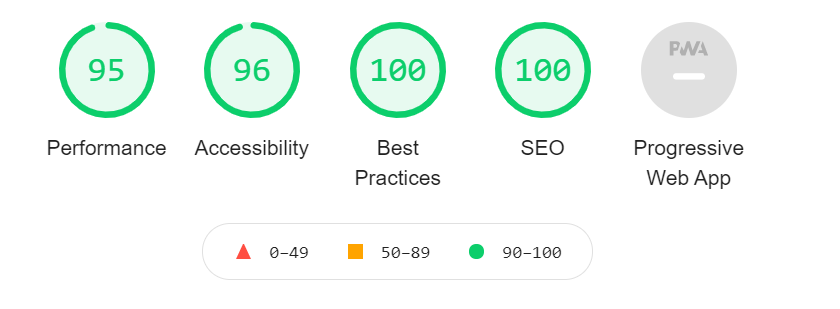

Overall this produced strong results. 

[return to contents](<#contents>)

## Bugs

* ### Fixed
    * While testing the site on browsers other than Chrome two bugs were discovered:
        * The navigation menu items are underlined to show the page the user is currently on. While using Chrome this was the same colour as the font but on other browsers it appeared blue:

            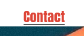

        * This was easily resolved using "text-decoration-color" in CSS. 

        * The second bug was the comment box on the form was allowed to be resized when using firefox or IE. As a result it stretched outside the form area 

            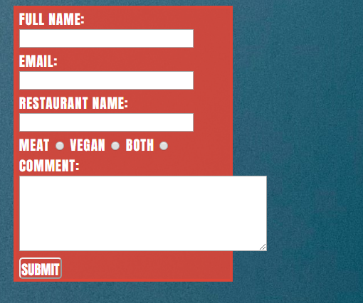

        * This was fixed by preventing the comment box from re-sizing using the CSS code "resize: none"

* ### Not Fixed
    * The form works as you would expect until it is time to submit at which point the data does not push anywhere. This is a known limitation of the project and would certainly be fixed ahead of being deployed in earnest. 

[return to contents](<#contents>)

# Deployment

The following steps can be followed to deploy this project on Github:
 
  1. In the GitHub repository, navigate to the Settings tab 
  2. From the source section drop-down menu, select the Master Branch
  3. Once the master branch has been selected, the page will be automatically refreshed with a detailed ribbon display to indicate the successful deployment. 

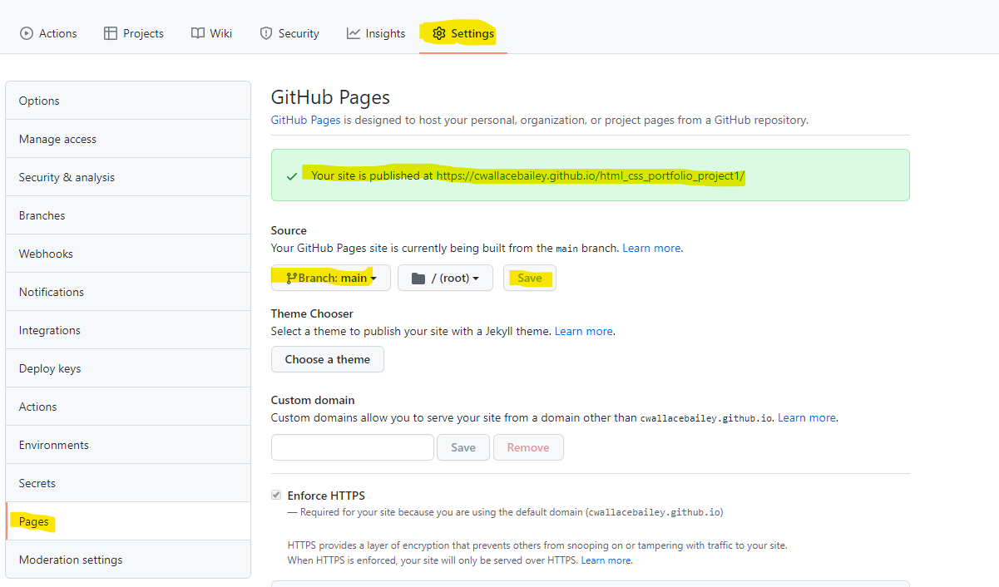

[return to contents](<#contents>)

# Credits 

* The images used in this project were largely taken from Pexels.com
* The icons were taken from font awesome (https://fontawesome.com/)
* The font was taken from google fonts (https://fonts.google.com)
* The description of how to deploy to font awesome was taken from the codeinstitute readme guide. 

I would also like to acknowledge Precious Liege, my mentor, for his great suggestions, pointers and help. Thank you for your time, Precious. 

[return to contents](<#contents>)